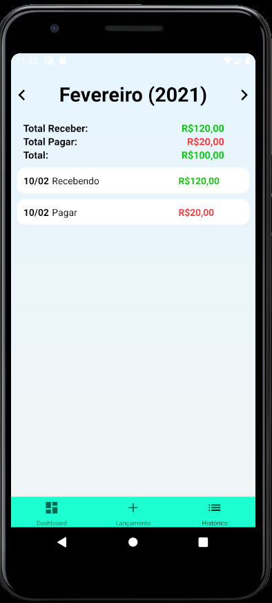

<h3 align="center">
  :moneybag:  FinFoX
</h3>

## Projeto
FinFoX é um projeto para controle de contas a pagar e contas a receber de modo simples e rápido. Desenvolvido para React 17+ e React-Native 0.63+

## Screenshots
<h1 align="center">
  
  
  
  
</h1>


### Running

```sh
yarn
yarn react-native run-android
```


